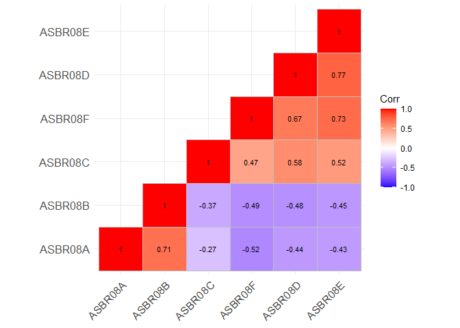
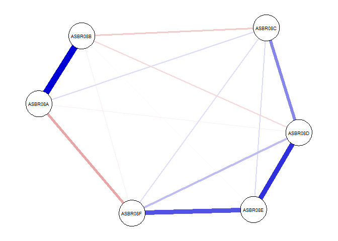
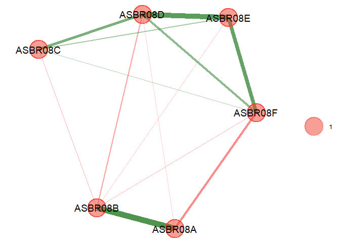
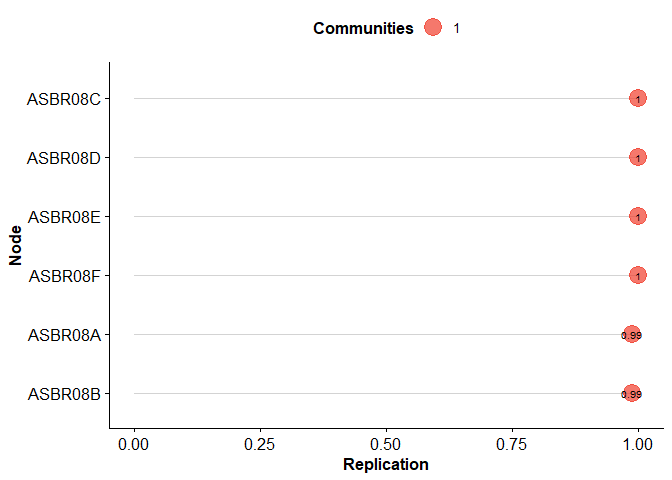
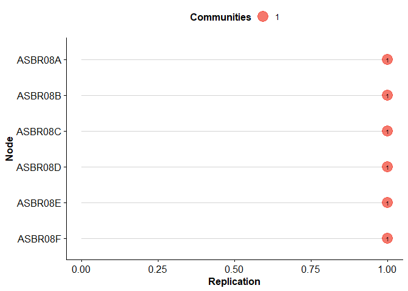
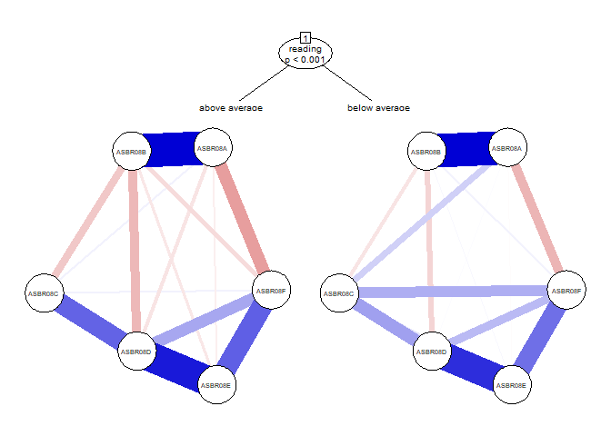

Psychometric Network Analysis
================

## Setting Up R

- **R version:** R-4.4.2 for Windows (<https://cran.r-project.org/>)
- **Rtools version:** Rtools44 for Windows
  (<https://cran.r-project.org/bin/windows/Rtools/rtools44/rtools.html>)
- **RStudio version:** RStudio 2024.12.0+467
- **More information on EGAnet** <https://r-ega.net/>

To download the dataset:

<https://raw.githubusercontent.com/okanbulut/network/master/scr_canada.csv>

To download the R markdown file:

<https://raw.githubusercontent.com/okanbulut/network/master/network.Rmd>

To download the entire repository:

<https://github.com/okanbulut/network/archive/refs/heads/main.zip>

``` r
install.packages(c("dplyr", "ggcorrplot", "psych", "bootnet", "psychonetrics", "EGAnet", "networktree"))

library("dplyr")
library("ggcorrplot")
library("psych")
library("bootnet")
library("psychonetrics")
library("EGAnet")
library("networktree")
```

# Student Confident in Reading (SCR) in PIRLS 2021

``` r
# Students from Alberta, Canada
scr_canada <- read.csv("scr_canada.csv", header = TRUE)

# First 6 rows of the data
head(scr_canada)
```

    ##   IDCNTRY IDPOP IDGRADER IDGRADE IDSCHOOL IDCLASS   IDSTUD ITSEX ITADMINI
    ## 1    9134     1        2       4     5001  500101 50010101     2        2
    ## 2    9134     1        2       4     5001  500101 50010102     2        2
    ## 3    9134     1        2       4     5001  500101 50010103     1        2
    ## 4    9134     1        2       4     5001  500101 50010104     2        2
    ## 5    9134     1        2       4     5001  500101 50010105     2        2
    ## 6    9134     1        2       4     5001  500101 50010106     2        2
    ##   ITLANG_SA ITLANG_SQ IDBOOK ASBR08A ASBR08B ASBR08C ASBR08D ASBR08E ASBR08F
    ## 1         1         1      1       1       1       3       3       4       3
    ## 2         1         1     31       2       1       3       3       3       3
    ## 3         1         1      2       2       1       2       9       2       1
    ## 4         1         1     18       1       1       3       3       4       4
    ## 5         1         1     32       2       2       2       4       4       4
    ## 6         1         1     10       1       1       1       3       4       4
    ##     HOUWGT   TOTWGT   SENWGT JKREP JKZONE ASRREA01 ASRREA02 ASRREA03 ASRREA04
    ## 1 1.486722 22.28132 0.246146     1     70 599.3167 564.9619 577.9405 586.3821
    ## 2 1.486722 22.28132 0.246146     1     70 616.6323 589.4565 637.1342 625.7600
    ## 3 1.486722 22.28132 0.246146     1     70 548.8263 575.0935 565.4134 573.0199
    ## 4 1.486722 22.28132 0.246146     1     70 619.5068 669.4913 617.9325 607.4834
    ## 5 1.486722 22.28132 0.246146     1     70 586.4464 654.7330 621.8628 631.6019
    ## 6 1.486722 22.28132 0.246146     1     70 548.9577 620.0773 579.7630 561.6681
    ##   ASRREA05 idbid
    ## 1 590.1711   RR5
    ## 2 660.9687   RR5
    ## 3 578.2300   RR5
    ## 4 628.2404   RR5
    ## 5 600.9162   RR5
    ## 6 605.2696   RR5

``` r
# Variable names
names(scr_canada)
```

    ##  [1] "IDCNTRY"   "IDPOP"     "IDGRADER"  "IDGRADE"   "IDSCHOOL"  "IDCLASS"  
    ##  [7] "IDSTUD"    "ITSEX"     "ITADMINI"  "ITLANG_SA" "ITLANG_SQ" "IDBOOK"   
    ## [13] "ASBR08A"   "ASBR08B"   "ASBR08C"   "ASBR08D"   "ASBR08E"   "ASBR08F"  
    ## [19] "HOUWGT"    "TOTWGT"    "SENWGT"    "JKREP"     "JKZONE"    "ASRREA01" 
    ## [25] "ASRREA02"  "ASRREA03"  "ASRREA04"  "ASRREA05"  "idbid"

``` r
# Select only the SCR items
scr <- dplyr::select(scr_canada, starts_with("ASBR08"))

# Remove students with no valid responses and recode 9 as missing
scr %<>%
  dplyr::filter_all(all_vars(!is.na(.))) %>%
  dplyr::mutate_all(~na_if(., 9)) %>%
  as.data.frame()
```

Let’s check the correlation matrix of the items in SCR.

``` r
# Save the correlation matrix
cormat <- psych::polychoric(x = scr)$rho

# Correlation matrix plot
ggcorrplot::ggcorrplot(corr = cormat, # correlation matrix
                       type = "lower", # print only the lower part of the matrix
                       hc.order = TRUE, # hierarchical clustering
                       show.diag = TRUE, # show the diagonal values of 1
                       lab = TRUE, # add correlation values as labels
                       lab_size = 3) # Size of the labels
```

<!-- -->

The correlation matrix above suggests that item wording effects might be
presented in the SCR scale. Let’s keep the original correlation matrix
and start analyzing the data using a Gaussian Graphical Model (GGM).

# Gaussian Graphical Model

``` r
network1 <- bootnet::estimateNetwork(
  data = scr, 
  corMethod = "cor_auto", # for polychoric and polyserial correlations
  default = "EBICglasso", # for estimating GGM with gLASSO and EBIC
  tuning = 0.5 # EBIC tuning parameter; set to zero for BIC model selection
)

# Print the estimated network
print(network1)
```

    ## 
    ## === Estimated network ===
    ## Number of nodes: 6 
    ## Number of non-zero edges: 14 / 15 
    ## Mean weight: 0.1111013 
    ## Network stored in network1$graph 
    ##  
    ## Default set used: EBICglasso 
    ##  
    ## Use plot(network1) to plot estimated network 
    ## Use bootnet(network1) to bootstrap edge weights and centrality indices 
    ## 
    ## Relevant references:
    ## 
    ##      Friedman, J. H., Hastie, T., & Tibshirani, R. (2008). Sparse inverse covariance estimation with the graphical lasso. Biostatistics, 9 (3), 432-441.
    ##  Foygel, R., & Drton, M. (2010). Extended Bayesian information criteria for Gaussian graphical models. 
    ##  Friedman, J. H., Hastie, T., & Tibshirani, R. (2014). glasso: Graphical lasso estimation of gaussian graphical models. Retrieved from https://CRAN.R-project.org/package=glasso
    ##  Epskamp, S., Cramer, A., Waldorp, L., Schmittmann, V. D., & Borsboom, D. (2012). qgraph: Network visualizations of relationships in psychometric data. Journal of Statistical Software, 48 (1), 1-18.
    ##  Epskamp, S., Borsboom, D., & Fried, E. I. (2016). Estimating psychological networks and their accuracy: a tutorial paper. arXiv preprint, arXiv:1604.08462.

``` r
# View the estimated network
plot(network1) 
```

<!-- -->

Let’s also try the same model using psychonetrics.

``` r
# Save item names
obsvars <- colnames(scr)

network2 <- psychonetrics::ggm(scr, vars = obsvars) %>%
  psychonetrics::runmodel()

# Check out model fit
network2 %>% psychonetrics::fit()
```

    ##            Measure     Value
    ##               logl -18423.40
    ##  unrestricted.logl -18423.40
    ##      baseline.logl -21018.71
    ##               nvar         6
    ##               nobs        27
    ##               npar        27
    ##                 df       ~ 0
    ##          objective      2.56
    ##              chisq       ~ 0
    ##             pvalue         1
    ##     baseline.chisq   5190.60
    ##      baseline.npar        12
    ##        baseline.df        15
    ##    baseline.pvalue       ~ 0
    ##                nfi         1
    ##               pnfi       ~ 0
    ##                tli          
    ##               nnfi         1
    ##                rfi          
    ##                ifi         1
    ##                rni         1
    ##                cfi         1
    ##              rmsea          
    ##     rmsea.ci.lower       ~ 0
    ##     rmsea.ci.upper       ~ 0
    ##       rmsea.pvalue       ~ 0
    ##             aic.ll  36900.81
    ##            aic.ll2  36901.37
    ##              aic.x       ~ 0
    ##             aic.x2        54
    ##                bic  37060.24
    ##               bic2  36974.46
    ##            ebic.25  37108.62
    ##             ebic.5  37157.00
    ##            ebic.75  37195.70
    ##              ebic1  37253.75

We can prune this model to remove insignificant edges.

``` r
network3 <- psychonetrics::ggm(scr, vars = obsvars) %>%
  psychonetrics::runmodel() %>%
  psychonetrics::prune(adjust = "fdr", alpha = 0.05)

# View the model parameters
network3 %>% psychonetrics::parameters()
```

    ## 
    ##  Parameters for group fullsample
    ##  -  mu  
    ##     var1 op var2  est    se        p row col par
    ##  ASBR08A ~1      1.40 0.012 < 0.0001   1   1   1
    ##  ASBR08B ~1      1.45 0.013 < 0.0001   2   1   2
    ##  ASBR08C ~1      2.50 0.020 < 0.0001   3   1   3
    ##  ASBR08D ~1      3.14 0.020 < 0.0001   4   1   4
    ##  ASBR08E ~1      3.38 0.019 < 0.0001   5   1   5
    ##  ASBR08F ~1      3.42 0.018 < 0.0001   6   1   6
    ## 
    ##  -  omega (symmetric) 
    ##     var1 op    var2    est    se        p row col par
    ##  ASBR08B -- ASBR08A   0.51 0.014 < 0.0001   2   1   7
    ##  ASBR08C -- ASBR08A  0.044 0.019    0.020   3   1   8
    ##  ASBR08D -- ASBR08A -0.054 0.017   0.0016   4   1   9
    ##  ASBR08F -- ASBR08A  -0.15 0.018 < 0.0001   6   1  10
    ##  ASBR08C -- ASBR08B -0.099 0.019 < 0.0001   3   2  11
    ##  ASBR08D -- ASBR08B  -0.11 0.017 < 0.0001   4   2  12
    ##  ASBR08F -- ASBR08B -0.065 0.018  0.00032   6   2  13
    ##  ASBR08D -- ASBR08C   0.27 0.018 < 0.0001   4   3  14
    ##  ASBR08E -- ASBR08C  0.083 0.019 < 0.0001   5   3  15
    ##  ASBR08F -- ASBR08C  0.078 0.019 < 0.0001   6   3  16
    ##  ASBR08E -- ASBR08D   0.44 0.015 < 0.0001   5   4  17
    ##  ASBR08F -- ASBR08D   0.17 0.018 < 0.0001   6   4  18
    ##  ASBR08F -- ASBR08E   0.34 0.017 < 0.0001   6   5  19
    ## 
    ##  -  delta (diagonal) 
    ##     var1  op    var2  est     se        p row col par
    ##  ASBR08A ~/~ ASBR08A 0.52 0.0070 < 0.0001   1   1  20
    ##  ASBR08B ~/~ ASBR08B 0.55 0.0074 < 0.0001   2   2  21
    ##  ASBR08C ~/~ ASBR08C 0.93  0.013 < 0.0001   3   3  22
    ##  ASBR08D ~/~ ASBR08D 0.72 0.0098 < 0.0001   4   4  23
    ##  ASBR08E ~/~ ASBR08E 0.69 0.0094 < 0.0001   5   5  24
    ##  ASBR08F ~/~ ASBR08F 0.74 0.0099 < 0.0001   6   6  25

``` r
# Look at the model fit
network3 %>% psychonetrics::fit()
```

    ##            Measure     Value
    ##               logl -18425.32
    ##  unrestricted.logl -18423.40
    ##      baseline.logl -21018.71
    ##               nvar         6
    ##               nobs        27
    ##               npar        25
    ##                 df         2
    ##          objective      2.57
    ##              chisq      3.83
    ##             pvalue      0.15
    ##     baseline.chisq   5190.60
    ##      baseline.npar        12
    ##        baseline.df        15
    ##    baseline.pvalue       ~ 0
    ##                nfi       1.0
    ##               pnfi      0.13
    ##                tli       1.0
    ##               nnfi       1.0
    ##                rfi      0.99
    ##                ifi       1.0
    ##                rni       1.0
    ##                cfi       1.0
    ##              rmsea     0.018
    ##     rmsea.ci.lower       ~ 0
    ##     rmsea.ci.upper     0.046
    ##       rmsea.pvalue      0.97
    ##             aic.ll  36900.64
    ##            aic.ll2  36901.12
    ##              aic.x     -0.17
    ##             aic.x2     53.83
    ##                bic  37048.26
    ##               bic2  36968.83
    ##            ebic.25  37093.06
    ##             ebic.5  37137.85
    ##            ebic.75  37173.69
    ##              ebic1  37227.44

``` r
# Compare the models
comparison <- psychonetrics::compare(
  `1. Original model`  = network2,
  `2. Sparse Model: Only Pruning` = network3)

print(comparison)
```

    ##                          model DF      AIC      BIC RMSEA Chisq Chisq_diff
    ##              1. Original model  0 36900.81 37060.24         ~ 0           
    ##  2. Sparse Model: Only Pruning  2 36900.64 37048.26 0.018  3.83       3.83
    ##  DF_diff p_value
    ##                 
    ##        2    0.15
    ## 
    ## Note: Chi-square difference test assumes models are nested.

# Exploratory Graph Analysis

``` r
# Dimension stability analysis via EGAnet
bootEGA1 <- EGAnet::bootEGA(
  data = scr, 
  cor = "cor_auto",
  uni.method = "louvain",
  iter = 500, # Number of replica samples to generate
  # resampling" for n random subsamples of the original data
  # parametric" for n synthetic samples from multivariate normal dist.
  type = "parametric", 
  # EGA Uses standard exploratory graph analysis
  # EGA.fit Uses total entropy fit index (tefi) to determine best fit of EGA
  # hierEGA Uses hierarchical exploratory graph analysis
  EGA.type = "EGA", 
  model = "glasso", 
  algorithm = "walktrap", # or "louvain" (better for unidimensional structures)
  # use "highest_modularity", "most_common", or "lowest_tefi"
  consensus.method = "highest_modularity", 
  typicalStructure = TRUE, # typical network of partial correlations
  plot.typicalStructure = TRUE, # returns a plot of the typical network
  ncores = 8, # Number of cores to use in computing results
  seed = 2024 # set the seed for replicability
)
```

<!-- --><!-- -->

``` r
# View the number of communities
bootEGA1$EGA
```

    ## Model: GLASSO (EBIC with gamma = 0.5)
    ## Correlations: cor_auto
    ## Lambda: 0.0770205025664863 (n = 100, ratio = 0.1)
    ## 
    ## Number of nodes: 6
    ## Number of edges: 13
    ## Edge density: 0.867
    ## 
    ## Non-zero edge weights: 
    ##      M    SD    Min   Max
    ##  0.115 0.230 -0.189 0.542
    ## 
    ## ----
    ## 
    ## Algorithm:  Louvain
    ## 
    ## Number of communities:  1
    ## 
    ## ASBR08A ASBR08B ASBR08C ASBR08D ASBR08E ASBR08F 
    ##       1       1       1       1       1       1 
    ## 
    ## ----
    ## 
    ## Unidimensional Method: Louvain
    ## Unidimensional: Yes
    ## 
    ## ----
    ## 
    ## TEFI: 0

``` r
bootEGA1$typicalGraph$typical.dim.variables
```

    ##     items dimension
    ## 1 ASBR08A         1
    ## 2 ASBR08B         1
    ## 3 ASBR08C         1
    ## 4 ASBR08D         1
    ## 5 ASBR08E         1
    ## 6 ASBR08F         1

``` r
# Dimension (i.e., structural) stability results
dim_scr <- EGAnet::dimensionStability(bootEGA1)
```

<!-- -->

``` r
dim_scr$dimension.stability
```

    ## $structural.consistency
    ##     1 
    ## 0.988 
    ## 
    ## $average.item.stability
    ##     1 
    ## 0.996

``` r
# Item stability results
dim_scr$item.stability
```

    ## EGA Type: EGA 
    ## Bootstrap Samples: 500 (Parametric)
    ## 
    ## Proportion Replicated in Dimensions:
    ## 
    ## ASBR08A ASBR08B ASBR08C ASBR08D ASBR08E ASBR08F 
    ##   0.988   0.988   1.000   1.000   1.000   1.000

``` r
dim_scr$item.stability$plot # to see only the plot
```

<!-- -->

# Random-Intercept EGA

Random-Intercept EGA estimates the number of dimensions after
controlling for wording effects. EGA is applied to a residual
correlation matrix after subtracting a random intercept factor model
with equal unstandardized loadings from all the regular and unrecoded
reversed items in the data.

``` r
riEGA <- EGAnet::bootEGA(
  scr, 
  uni.method = "LE",
  iter = 500,
  type = "parametric",
  cor = "cor_auto",
  model = "glasso",
  EGA.type = "riEGA", # select random-intercept EGA here
  consensus.method  = "highest_modularity", 
  consensus.iter = 100,
  algorithm="walktrap",
  seed = 2024
)
```

<!-- -->

# Network Tree Analysis

In the final step, we will analyze whether the network structure of the
SCR scale differs by gender and reading achievement (i.e., above or
below the mean reading achievement score) using network tree analysis.

``` r
scr2 <- dplyr::select(scr_canada, starts_with("ASBR08"), ITSEX, ASRREA01) %>%
  dplyr::filter_all(all_vars(!is.na(.))) %>%
  dplyr::mutate_all(~na_if(., 9)) %>%
  dplyr::mutate(gender = as.factor(ifelse(ITSEX==1,"girl", 
                                          ifelse(scr_canada$ITSEX==2, "boy", NA))),
                reading = as.factor(ifelse(ASRREA01 < 500, "below average", "above average"))) %>%
  dplyr::select(-ITSEX, ASRREA01) %>%
  as.data.frame()


nmt_scr <- networktree::networktree(nodevars=scr, 
                                    splitvars=scr2[,c("gender", "reading")],
                                    transform="pcor",
                                    na.action=na.omit)

plot_scr <- plot(nmt_scr, transform="pcor", maximum=0.2, edge.width=5, vsize=12, theme="colorblind", tnex = 3, partyargs=list(ep_args = list(justmin = 15), gp = grid::gpar(cex = .6)))
```

<!-- -->
